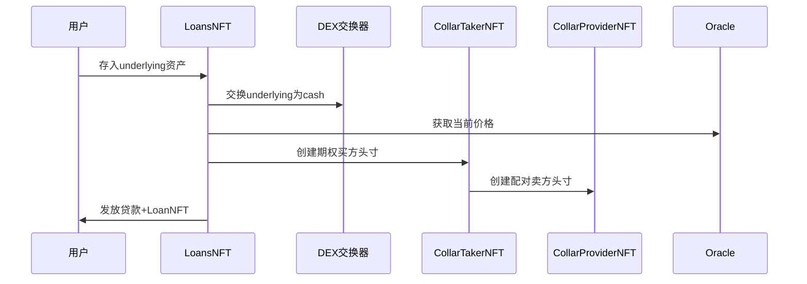
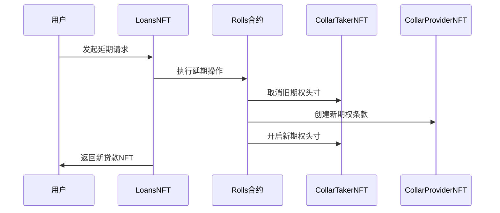
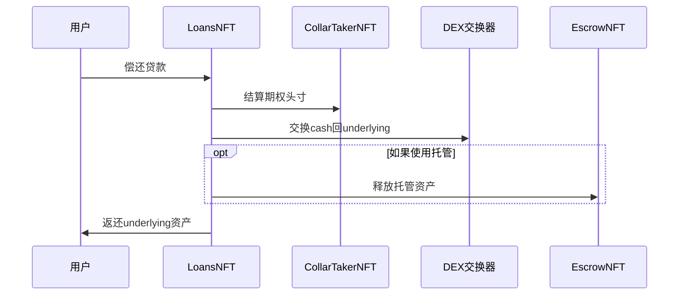

# Votre协议产品需求文档（PRD）

## 1. 产品概述

Votre（原Collar协议）是一个创新的无清算DeFi借贷协议，通过结合DEX交换和期权策略结构来实现高LTV（贷款价值比）借贷而不会面临强制清算风险。

### 1.1 核心价值主张

- **无清算风险**：资产在开仓时即完成交换，消除定向风险
- **高LTV借贷**：支持高达95%的贷款价值比
- **无利息支付**：成本在初始条款中预先定价
- **免托管**：用户保持完全控制权，头寸可自动到期
- **税收优化**：在许多司法管辖区可延迟税务义务
- **抵押品高效**：无需大量抵押品且不引入信用风险

### 1.2 目标用户群体

根据[Votre官网](https://www.votre.xyz/)信息，主要面向：
- **高净值个人**：寻求安全、高效的借贷解决方案
- **家族办公室**：需要灵活的资金管理工具
- **基金机构**：追求资本效率优化的专业投资者

## 2. 协议架构

### 2.1 核心智能合约模块

#### 2.1.1 LoansNFT（借贷合约）
**职责**：管理借贷生命周期的主入口合约
- 开启贷款（含或不含托管）
- 关闭贷款和偿还
- 借贷延期（rolling）
- Keeper自动化功能
- 与CollarTakerNFT的包装层

**关键功能**：
```solidity
function openLoan(uint underlyingAmount, uint minLoanAmount, SwapParams swapParams, ProviderOffer providerOffer)
function openEscrowLoan(uint underlyingAmount, uint minLoanAmount, SwapParams swapParams, ProviderOffer providerOffer, EscrowOffer escrowOffer, uint escrowFees)
function closeLoan(uint loanId, SwapParams swapParams)
function rollLoan(uint loanId, RollOffer rollOffer, int minToUser, uint newEscrowOfferId, uint newEscrowFee)
```

#### 2.1.2 CollarTakerNFT（期权买方合约）
**职责**：管理期权结构的买方头寸
- 创建配对的期权头寸
- 价格结算逻辑
- Oracle价格集成
- 头寸到期处理

**期权机制核心**：
```solidity
// 计算行权价格
function _strikePrices(uint putStrikePercent, uint callStrikePercent, uint startPrice) 
    returns (uint putStrikePrice, uint callStrikePrice)

// 结算计算
function _settlementCalculations(TakerPosition position, uint endPrice)
    returns (uint takerBalance, int providerDelta)
```

#### 2.1.3 CollarProviderNFT（期权卖方合约）
**职责**：管理流动性提供者的期权卖方头寸
- 创建和管理流动性报价
- 计算协议费用
- 头寸结算和提取
- 与买方头寸的配对

#### 2.1.4 ConfigHub（配置中心）
**职责**：系统级配置管理
- 合约间授权管理
- LTV和期限范围设置
- 协议费用参数
- 资产对支持配置

#### 2.1.5 Oracle系统
**支持的Oracle类型**：
- **ChainlinkOracle**：基于Chainlink价格feed
- **CombinedOracle**：组合多个Oracle的复合价格
- **OracleUniV3TWAP**：基于Uniswap V3的时间加权平均价格

### 2.2 期权机制详解

#### 2.2.1 Collar策略结构

Votre采用"Collar"期权策略，这是一个由看涨期权和看跌期权组成的保护性策略：

1. **Put期权（看跌期权）**：
   - 行权价格 = 开仓价格 × putStrikePercent
   - 提供下行保护
   - putStrikePercent等于LTV比率

2. **Call期权（看涨期权）**：
   - 行权价格 = 开仓价格 × callStrikePercent  
   - 限制上行收益
   - 通常callStrikePercent > 100%

#### 2.2.2 期权策略的真实实现

**重要澄清**：Votre协议中的"期权"实际上是通过数学计算和资金锁定来模拟的，而不是传统意义上的期权交易。

**核心机制**：
1. **资金锁定**：Taker和Provider分别锁定一定金额的cash资产
2. **价格变动时的资金重新分配**：基于Oracle价格变动按比例重新分配锁定的资金
3. **线性结算模型**：在put-call区间内，资金按价格变动比例线性分配

#### 2.2.3 资金流向和风险对冲机制

**开仓时的资金流程**：
```
用户存入ETH → 交换为USDC → 分配资金：
├── loanAmount (借贷金额，转给用户)
├── takerLocked (Taker锁定金额，用于期权保证金)
└── providerLocked (Provider锁定金额，通过calculateProviderLocked计算)
```

**Provider锁定金额计算公式**：
```solidity
function calculateProviderLocked(uint takerLocked, uint putStrikePercent, uint callStrikePercent)
    returns (uint)
{
    uint putRange = BIPS_BASE - putStrikePercent;      // 100% - 80% = 20%
    uint callRange = callStrikePercent - BIPS_BASE;    // 110% - 100% = 10%
    
    // 按比例缩放，确保双方风险平衡
    return takerLocked * callRange / putRange;         // 1000 × 10% / 20% = 500
}
```

**示例**：如果putStrikePercent = 80%（LTV），callStrikePercent = 110%
- putRange = 100% - 80% = 20%
- callRange = 110% - 100% = 10%
- providerLocked = takerLocked × 10% / 20% = takerLocked × 0.5

#### 2.2.4 结算逻辑详解

期权结算采用线性计算而非几何计算，**关键特性**：结算价格被限制在put-call区间内。

```solidity
// 限制endPrice在put-call区间内
endPrice = Math.max(Math.min(endPrice, callStrikePrice), putStrikePrice);
```

**这意味着**：
- 即使ETH价格跌到0，结算时使用的价格也不会低于putStrikePrice
- 即使ETH价格涨到无限高，结算时使用的价格也不会高于callStrikePrice

**结算计算逻辑**：

**场景1：价格下跌（endPrice < startPrice）**
```solidity
if (endPrice < startPrice) {
    // 价格下跌：taker的锁定资金在taker和provider之间分配
    uint providerGainRange = startPrice - endPrice;  // 价格下跌范围
    uint putRange = startPrice - putStrikePrice;     // put保护范围
    uint providerGain = position.takerLocked * providerGainRange / putRange;
    
    takerBalance = position.takerLocked - providerGain;
    providerDelta = providerGain.toInt256();
}
```

**场景2：价格上涨（endPrice > startPrice）**
```solidity
} else {
    // 价格上涨：provider的锁定资金在taker和provider之间分配
    uint takerGainRange = endPrice - startPrice;    // 价格上涨范围
    uint callRange = callStrikePrice - startPrice;  // call限制范围
    uint takerGain = position.providerLocked * takerGainRange / callRange;
    
    takerBalance = position.takerLocked + takerGain;
    providerDelta = -takerGain.toInt256();
}
```

#### 2.2.5 协议费用机制详解

**费用来源**：费用不是从平台垫付，而是从provider的报价金额中扣除。

```solidity
// 在mintFromOffer函数中
(uint fee, address feeRecipient) = protocolFee(providerLocked, offer.duration, offer.callStrikePercent);

// 检查报价金额是否足够
require(providerLocked + fee <= prevOfferAmount, "provider: offer < position + fee");

// 更新报价可用金额
uint newAvailable = prevOfferAmount - providerLocked - fee;
```

**费用计算公式**：
```solidity
fee = Math.ceilDiv(providerLocked * apr * duration, (callStrikePercent - BIPS_BASE) * YEAR);
```

**资金流向图**：
```
Provider的报价金额(prevOfferAmount)
├── providerLocked (锁定金额)
├── fee (协议费用，转给feeRecipient)
└── 剩余金额 (newAvailable)
```

## 3. 业务流程

### 3.1 开启借贷流程

#### 3.1.1 流动性准备阶段（Provider主动）
根据[Votre文档](https://docs.votre.xyz/loan/request-quote/)，借贷流程首先需要流动性准备：

```solidity
// 1. 流动性提供者创建报价
Provider.createOffer(
    callStrikePercent: 11000,  // 110%
    amount: 10000,             // 提供10000 USDC流动性
    putStrikePercent: 8000,    // 80% (LTV)
    duration: 30 days,
    minLocked: 100            // 最小头寸100 USDC
);
```

**关键点**：
- **必须提前执行**：createOffer必须在openLoan之前执行
- **资金预先锁定**：Provider在创建报价时就将资金转移到合约
- **条款预先确定**：LTV、期限、行权价等参数在报价时确定

#### 3.1.2 标准借贷流程


**内部详细流程**：
```solidity
function _openLoan(...) {
    // 1. 将ETH交换为USDC
    uint cashFromSwap = _swap(underlying, cashAsset, underlyingAmount, swapParams);
    
    // 2. 计算借贷金额和锁定金额
    uint loanAmount = ltvPercent * cashFromSwap / BIPS_BASE;
    uint takerLocked = cashFromSwap - loanAmount;
    
    // 3. 调用CollarTakerNFT开启期权头寸
    (uint takerId, uint providerId) = collarTakerNFT.openPairedPosition(
        takerLocked, providerNFT, offerId
    );
}
```

#### 3.1.3 托管借贷流程
在标准流程基础上，增加托管层：
- 用户资产存入EscrowSupplierNFT
- 使用托管方的资产进行交换
- 到期时通过托管系统归还

### 3.2 借贷延期（Rolling）流程

根据[Votre文档](https://docs.votre.xyz/loan/roll-loan/)，借贷延期是Votre协议的重要特性：

**延期借贷的优势**：
- **延长借贷期限**：获得更多时间管理财务
- **改善借贷条款**：可能获得更好的利率
- **避免违约**：防止因无法按时还款而违约
- **抓住市场机会**：释放资金用于其他投资



### 3.3 借贷关闭流程



**关键机制**：在借贷关闭时，Votre协议执行**反向交换**操作，将cash资产交换回underlying资产。

```solidity
function closeLoan(uint loanId, SwapParams calldata swapParams) external returns (uint underlyingOut) {
    // 1. 用户偿还贷款金额（cash资产）
    uint repayment = loan.loanAmount;
    cashAsset.safeTransferFrom(borrower, address(this), repayment);
    
    // 2. 计算总可用cash金额
    uint cashAmount = repayment + takerWithdrawal;  // 还款 + 期权头寸结算
    
    // 3. 🔑 关键步骤：将cash资产交换回underlying资产
    uint underlyingFromSwap = _swap(cashAsset, underlying, cashAmount, swapParams);
    
    // 4. 处理托管（如果使用）
    underlyingOut = _conditionalEndEscrow(loan, underlyingFromSwap);
    
    // 5. 将underlying资产转移给用户
    underlying.safeTransfer(borrower, underlyingOut);
}
```

## 4. 期权策略示例

### 4.1 场景设置
- 用户抵押：1 ETH (价值$3000)
- LTV：80%
- Put Strike：80% ($2400)
- Call Strike：110% ($3300)
- 贷款金额：$2400

### 4.2 不同价格场景下的结算

#### 场景1：价格下跌至$2000（跌破put行权价）
```
结算价格被限制为putStrike = $2400（关键保护机制）
Taker最终余额 = takerLocked - providerGain
Provider获得：($3000-$2400) × takerLocked / ($3000-$2400) = takerLocked
结果：Taker失去所有锁定资金，Provider获得所有takerLocked
```

#### 场景2：价格下跌至$1500（远低于put行权价）
```
结算价格仍然被限制为putStrike = $2400
结果与场景1完全相同：Taker失去所有锁定资金，Provider获得所有takerLocked
```

#### 场景3：价格上涨至$3500（超过call行权价）
```
结算价格被限制为callStrike = $3300
Taker获得额外收益：($3300-$3000) × providerLocked / ($3300-$3000)
Provider承担相应损失
```

#### 场景4：价格稳定在$3000
```
无价格变动，双方保持原有资金
```

### 4.3 风险分布图

```
价格区间          Taker收益/损失          Provider收益/损失
< 80%           -100% (最大损失)       +100% (最大收益)
80% - 100%      按比例损失             按比例收益
100%            0 (无变化)             0 (无变化)
100% - 110%     按比例收益             按比例损失
> 110%          +50% (最大收益)        -50% (最大损失)
```

## 5. 风险管理

### 5.1 Oracle风险缓解
- 多重价格源支持（Chainlink + Uniswap TWAP）
- Sequencer停机检查（L2网络）
- 价格时效性验证
- Oracle故障时的应急结算机制

### 5.2 清算风险消除
- **开仓时即完成资产交换**：消除价格波动风险
- **期权策略限制最大损失**：通过资金锁定机制
- **无需监控抵押率变化**：风险在开仓时已完全对冲

### 5.3 价格风险控制机制

**核心保护机制**：结算价格被严格限制在put-call区间内

```solidity
// 无论价格跌多少，taker的最大损失都是固定的
uint maxTakerLoss = takerLocked;  // 最大损失 = 锁定的资金

// 无论价格涨多少，taker的最大收益都是固定的
uint maxTakerGain = providerLocked;  // 最大收益 = provider锁定的资金
```

**为什么这样设计是安全的**：
1. **风险完全被限制**：taker的最大损失就是锁定的资金
2. **资金充足性保证**：provider锁定的资金正好覆盖taker的最大收益
3. **无清算风险**：所有风险都在开仓时通过资金锁定被对冲

### 5.4 智能合约安全
- 重入攻击保护
- 严格的权限控制
- 多重审计验证
- 暂停和紧急模式

## 6. 经济模型

### 6.1 协议费用
- 基于全名义价值收取年化费用
- 费用计算：providerLocked × feeAPR × duration / ((callStrikePercent - 100%) × YEAR)
- 最大费用限制：1%

### 6.2 激励机制
- 流动性提供者通过期权费获得收益
- Keeper网络维护头寸结算
- 协议费用支持系统维护

### 6.3 做市商激励机制

根据[Votre官网](https://www.votre.xyz/)信息，做市商通过"gamma scalping"技术获利：

**做市商盈利模式**：
- 通过期权对冲技术管理波动性
- 获得小额利差来维持运营
- 作为交换，做市商保证借贷的上行收益

**预期做市商数量**：上线初期预计有3个成熟的期权做市商合作伙伴

## 7. 技术规范

### 7.1 关键参数
- 最小LTV：10%
- 最大LTV：99.99%  
- 最小期限：5分钟
- 最大期限：5年
- 最大协议费：1%

### 7.2 资产要求
- 支持标准ERC20代币
- 无回流、无转账费用
- 与DEX有足够流动性
- 启动时支持cbBTC和WETH

### 7.3 网络部署
- 以太坊主网
- Arbitrum
- Base（OP Stack）
- 其他EVM兼容链

### 7.4 交换机制

根据[Votre文档](https://docs.votre.xyz/economics/swap-trade/)，交换机制特点：

**交换场所**：
- 目前：Uniswap
- 计划扩展：流行的DEX聚合器和OTC做市商

**滑点影响**：
- 交换会产生滑点
- 借贷的上下限基于交换执行价格计算
- 这是Votre协议的少数缺点之一

## 8. 用户场景

### 8.1 投资者场景
**需求**：在不出售资产的情况下获得流动性
**解决方案**：通过Votre借贷保持资产敞口同时获得现金

### 8.2 基金管理者场景  
**需求**：优化资本效率，避免出售优质资产
**解决方案**：高LTV借贷释放流动性用于其他投资机会

### 8.3 流动性提供者场景
**需求**：为闲置资金寻找收益机会
**解决方案**：通过提供期权流动性获得费用收入

### 8.4 高净值个人场景
**需求**：安全、高效的借贷解决方案
**解决方案**：无清算风险、税收优化的借贷服务

## 9. 合规考虑

### 9.1 监管合规
- 在不同司法管辖区的可用性评估
- 税务优化结构的合规性验证
- 反洗钱（AML）和了解客户（KYC）集成点

### 9.2 风险披露
- 期权策略风险教育
- 智能合约风险提示
- Oracle依赖性说明

## 10. 路线图

### 10.1 第一阶段（已完成）
- 核心协议开发
- 智能合约审计
- 测试网部署

### 10.2 第二阶段（当前）
- 主网部署
- cbBTC/WETH支持
- 前端界面优化

### 10.3 第三阶段（规划中）
- 更多资产对支持
- 移动端应用
- 自动化策略工具

## 11. 常见问题解答

### 11.1 为什么称为"期权"？
Votre协议中的"期权"实际上是通过数学计算和资金锁定来模拟的，而不是传统意义上的期权交易。这是一种风险对冲策略，通过预先锁定资金来消除清算风险。

### 11.2 如何避免清算风险？
通过"预先交换"机制：资产在开仓时即完成交换，期权策略限制最大损失，所有风险都在开仓时被精确计算和对冲。

### 11.3 费用是如何收取的？
协议费用从provider的报价金额中扣除，由provider承担，不是平台垫付。费用基于完整的名义价值计算。

### 11.4 价格跌破put行权价怎么办？
结算价格被限制在put行权价之上，taker的最大损失就是锁定的资金，风险完全可控。

---

*本文档基于Votre协议v0.3.0的源码分析编写，详细技术实现请参考具体的智能合约代码。*

*参考资料：*
- [Votre官网](https://www.votre.xyz/)
- [Votre文档 - 请求报价](https://docs.votre.xyz/loan/request-quote/)
- [Votre文档 - 借贷延期](https://docs.votre.xyz/loan/roll-loan/)
